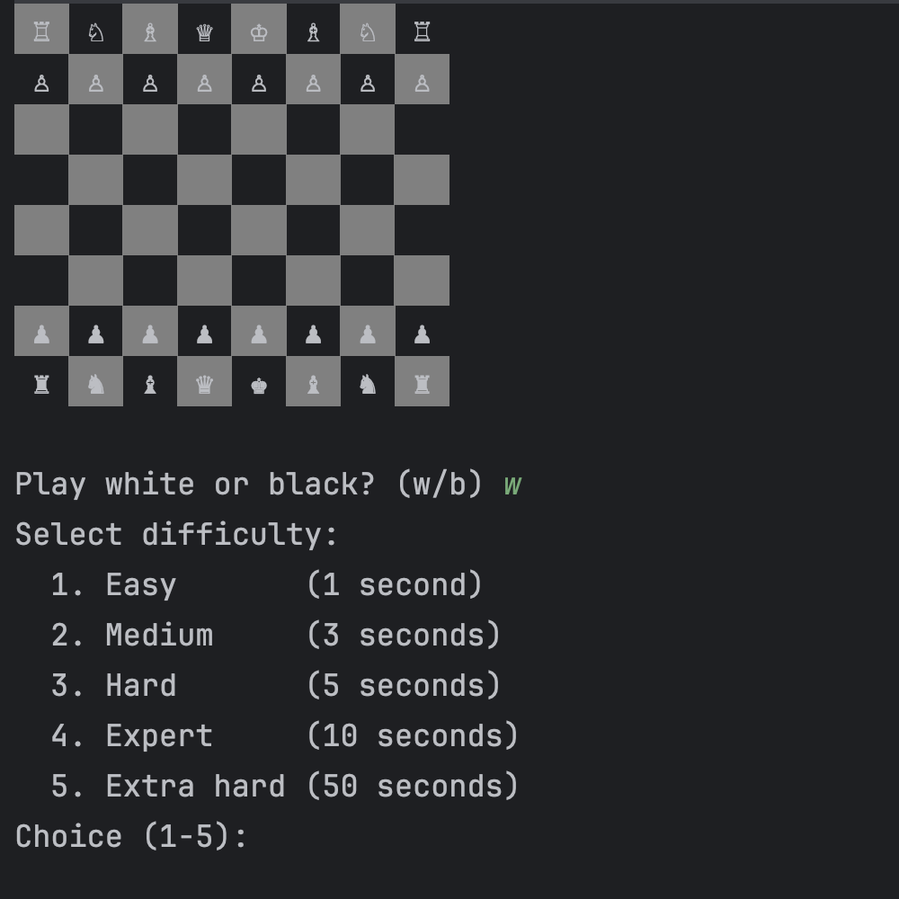

# Terminal AI-Chess

Simple Java 22 chess app that uses bitboards. This implementation is mainly for learning the bitboard data-structure. It amazes me how effective and compact this format is, even though it's hard to correctly implement bit-shifting and bit-masking.

PS: This is still work in progress. The app will only respond with random moves at the moment.

In your terminal, this is how the app will look like.

#### TODOs:
- [x] Implement basic bitboard
- [x] Implement terminal ui
- [x] Implement basic move generation
- [ ] Implement complete move generation (checks, attacks, castling, en-passant, promotions)
- [ ] Implement perft move generation analysis
- [ ] Implement basic ai (𝛼/ϐ search)
- [ ] Implement advanced ai (monte-carlo-sim & neural networks)