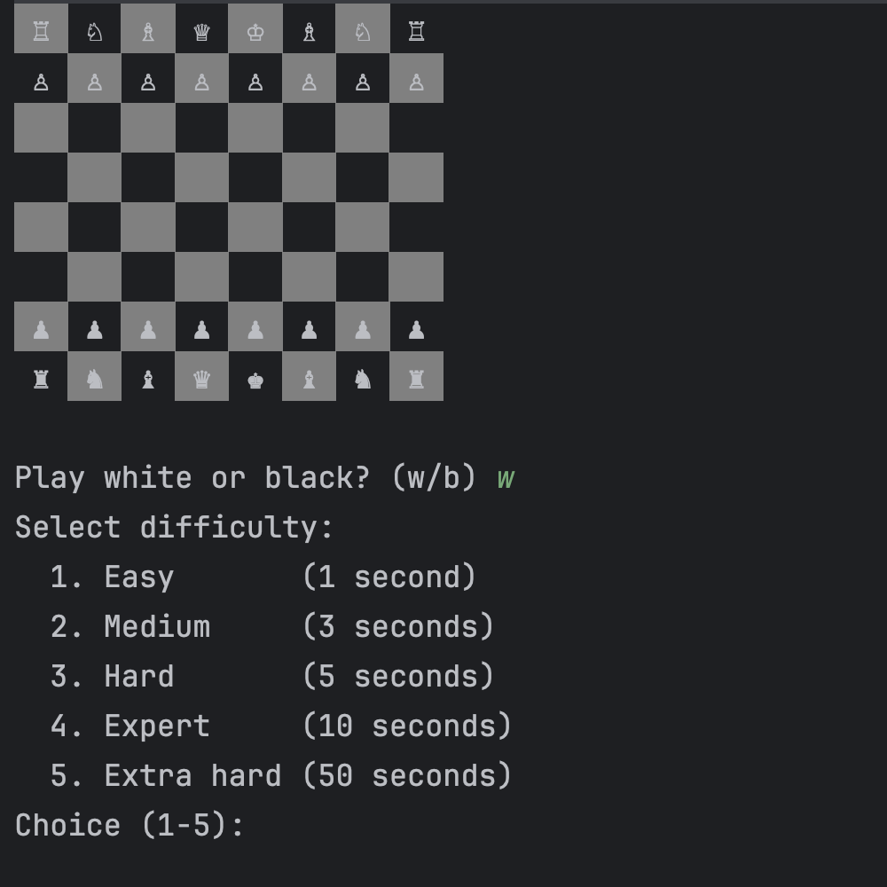

# Terminal Games

The project contains three board games that are playable directly from the terminal. I created this repo because my previous trials to implement Java-based chess engines with x88 and traditional for-loops resulted in very slow engines that played poor chess. The goal of this project is, therefore, to learn advanced board representations and move generation algorithms with efficient bit-shifting techniques.

A simple version of the well-known minimax-based 𝛼/ϐ algorithm can generate strong moves for simple games with limited search space and simple heuristics. Chess, however, has an infinitely large search space that can quickly exhaust the memory and the cpu. To tackle that problem in chess, the 𝛼/ϐ cutoff search must be extended with optimizations, memory-efficient data-formats and a strong heuristic analysis and evaluation.

## Terminal Chess
Simple Java 25 chess app that uses bitboards. The implementation is mainly for learning the Bitboard data-structure, one of the most effective and compact data formats for chess. The implementation features a sudo-move generator split into multiple individual generators. All generated moves are encoded into a compact 32-bit data storage format based on my own work with earlier chess engines.

This engine uses Magic Bitboards, which allow the engine to rapidly generate attacks and sliding piece moves without loops. As it is severely hard to correctly implement bit-shifting and bit-masking correctly on Magic Bitboards, the inspiration for the magic numbers implementation is based on examples shared at the [Chess Programming Wiki](https://www.chessprogramming.org/Magic_Bitboards) website. Before Magic Bitboards, I used Java streams and loops to calculate attacks and sliding moves. This technique worked but was extremely slow and analyzed only up to four-ply depth. You can read about the [ideas behind it in the README file](src/main/java/no/dervis/terminal_games/terminal_chess/moves/attacks/history/README.md). With Magic Bitboards, however, we can analyze tens of millions of positions in a few seconds.

The engine features two ai players – a single-threaded ai, and a multithreaded parallel ai that processes multiple millions of more nodes than the single-threaded version.

PS: The AI plays strong games without an opening book, even at level 1. This is still a work in progress.

Running in your terminal:
`java --enable-preview --source 25  src/main/java/no/dervis/terminal_games/terminal_chess/TerminalChess.java`

In your terminal, this is what the app will look like.



See the [README for more information](src/main/java/no/dervis/terminal_games/terminal_chess/README.md) about how to play.

**TODOs:**
- [x] Implement basic bitboard
- [x] Implement terminal ui
- [x] Implement SAN parsing for better input handling
- [x] Implement basic move generation
- [x] Implement complete move generation (checks, attacks, castling, en-passant, promotions)
- [x] Implement legal moves filtering
- [x] Implement FEN string generation
- [x] Implement perft move generation analysis
- [x] Implement basic AI (𝛼/ϐ search)
- [x] Implement advanced AI (𝛼/ϐ search + iterative deepening + quiescence search + Negamax + Principal Variation Search (PVS) + transposition table + check extensions + Late Move Reductions (LMR) + Killer & History heuristics + time management)
- [x] Implement multithreaded parallel processing ai
- [ ] Implement opening book
- [ ] Implement superior ai (monte-carlo simulation and neural networks)

### Move generation correctness

The move generator is validated with [perft](https://www.chessprogramming.org/Perft_Results) -- a standard test that counts leaf nodes at each depth and compares against known-correct values from the [Chess Programming Wiki](https://www.chessprogramming.org/Perft_Results).

Unit tests cover depths 1--5 for all six positions. A standalone deep runner pushes further:

| Position | Max depth | Nodes at max depth |
|----------|----------:|-----------:|
| [Initial position](https://www.chessprogramming.org/Perft_Results#Initial_Position) | 6 | 119,060,324 |
| [Kiwipete](https://www.chessprogramming.org/Perft_Results#Position_2) | 6 | 8,031,647,685 |
| [Position 3](https://www.chessprogramming.org/Perft_Results#Position_3) (endgame) | 7 | 178,633,661 |
| [Position 4](https://www.chessprogramming.org/Perft_Results#Position_4) (promotions) | 6 | 706,045,033 |
| [Position 5](https://www.chessprogramming.org/Perft_Results#Position_5) (discovered checks) | 5 | 89,941,194 |
| [Position 6](https://www.chessprogramming.org/Perft_Results#Position_6) (mirrored) | 6 | 6,923,051,137 |

All results match at every depth. The `--parallel` flag distributes root moves across all cores (copy-make means each thread gets its own board with zero contention):

| Position | Single-threaded | Parallel (14 cores) | Speedup |
|----------|----------------:|---------:|--------:|
| 1 (initial) depth 6 | 6,803ms | 1,314ms | **5.2x** |
| 2 (Kiwipete) depth 6 | 471,712ms | 101,960ms | **4.6x** |
| 3 (endgame) depth 6 | 759ms | 102ms | **7.4x** |
| 4 (promotions) depth 6 | 42,112ms | 9,320ms | **4.5x** |
| 5 (discovered checks) depth 5 | 5,216ms | 626ms | **8.3x** |
| 6 (mirrored) depth 6 | 401,771ms | 54,662ms | **7.4x** |

To run the deep tests:

```bash
# single-threaded
java -cp target/classes no.dervis.terminal_games.terminal_chess.PerftDeep --depth 7

# parallel — root moves split across all available cores
java -cp target/classes no.dervis.terminal_games.terminal_chess.PerftDeep --depth 7 --parallel
```


## Terminal Tic-tac-toe
A complete Java 25 Tic-tac-toe game that can scale to custom sized nxn boards.

**TODOs:**
- [x] Implement list-based board
- [x] Implement board scaling
- [x] Implement terminal ui
- [x] Implement move generation
- [x] Implement basic ai (minimax with 𝛼/ϐ cutoff)

## Terminal Checkers
A Java 25 checkers game that uses a map-based board. It supports regular moves, jump moves and kings.

PS: This is still a work in progress. The game works but will only respond with random moves at the moment.

**TODOs:**
- [x] Implement map-based board
- [x] Implement terminal ui
- [x] Implement basic move generation
- [x] Implement complete move generation (forward and backward moves, jump moves)
- [ ] Implement basic ai (minimax with 𝛼/ϐ cutoff)

## Documentation
https://deepwiki.com/dervism/terminal-aichess
